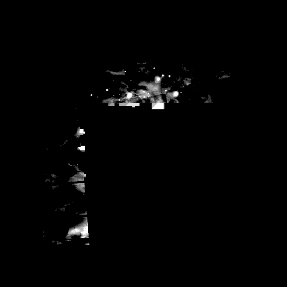

# Validación visual · fase 1 del catálogo de texturas DSO

Ejecución del procedimiento de `notas/validacion-visual-difusas.md` sobre el
cambio que define la fase: **de dónde sale el parche difuso**. La etiqueta
`antes` es el camino viejo —el FITS del stack por `lib_bajar_parche`— y la
etiqueta `despues` es el nuevo: la textura publicada, leída con el
`ps1LeerTextura` del navegador. Las dos pintan con el mismo montaje de
producción (`lib_parche_produccion` + `ps1PintarParche`) y el mismo Gaia, así
que lo único que cambia entre las dos columnas es la fuente de los píxeles.

Fecha: 2026-09-08. Issue #206 (T9 de la US-4, #196).

## Cómo se sacaron

```
node scripts/gen_fixtures_gaia.js --vistas                       # los 5 CSV que faltaban
node scripts/harness_vistas_np.js --etiqueta antes               # camino FITS
node scripts/gen_dso_texturas.js --solo "<objeto>" --dir .scratch/dso-vistas
node scripts/harness_vistas_np.js --etiqueta despues --fuente textura --dir .scratch/dso-vistas
```

- **Gaia**: los 11 CSV pineados de `scripts/fixtures/gaia/` y los 5 de solo-mirar
  (NGC 4486, NGC 4826, NGC 253, NGC 3310, NGC 1982) generados a la caché, como
  manda la decisión 9.1. Ninguna vista se saltó por falta de Gaia.
- **Texturas**: las 11 del banco golden salen de `scripts/fixtures/dso/`; las de
  los objetos de solo-mirar se regeneraron desde la caché de FITS, y sus hashes
  salieron **idénticos** a los publicados (`NGC_4486.d6572d0d`,
  `NGC_4826.f11e1a5a`, `NGC_253.f14c873a`, `NGC_3310.96d30fe1`,
  `NGC_205.36557645`), así que la vista de la textura es la de producción.
- El manifiesto y el informe generado que `gen_dso_texturas.js` reescribe al
  cerrar se restauraron: esta corrida no publica texturas nuevas.

## Cobertura

| etiqueta | vistas | falta alguna |
|---|---|---|
| `antes` | 26 de 26 | no |
| `despues` | 24 de 26 | sí: las dos de NGC 1982, con motivo `ausencia-excesiva` |

Ninguna vista falta por Gaia sin generar, que es lo que el criterio prohíbe. Las
dos que faltan en `despues` faltan por un **veredicto del generador**: NGC 1982
no tiene imagen donde está el objeto (#229), así que no hay textura que leer y
la capa difusa se apaga para él. Es la causa nombrada de esas dos filas.

## Qué se buscaba, y qué salió

La lista de lo que descalifica una vista —halos nuevos, zonas negras dentro del
objeto, sobrecontraste, bordes rectos o cuadrados, punteado o malla, el objeto
que desaparece o cambia de tamaño angular— se aplicó a las 24 parejas de tres
maneras, porque ninguna basta sola: la resta píxel a píxel de las dos PNG (que
caza lo que el ojo no ve), una hoja de contactos de las 24 con el contraste
estirado al percentil 99,9 (que es donde un halo o una malla se delatan aunque
vivan tres niveles por encima del fondo), y tres parejas a tamaño completo —M1,
NGC 6888 y NGC 253, las tres que tienen bordes o rayas que mirar—. Más la línea
de resumen del harness en las 26.

- **Ni un halo, ni una zona negra, ni un borde recto, ni punteado NUEVOS.** El
  borde cuadrado del parche de M1, el redondeado de NGC 6888 y las rayas de
  máscara de estrellas de NGC 253 están **igual en las dos etiquetas**: son de
  antes de la fase y no los trae la textura.
- **Sobrecontraste: ninguno.** El nivel máximo coincide en las 24 vistas y nadie
  llega a 255; el núcleo saturado de M87 pinta 110 y 96 en sus dos configuraciones,
  las mismas antes y después.
- **Tamaño angular: idéntico.** `θint` coincide en las 26 vistas, así que a
  igualdad de aumento el objeto ocupa lo mismo.
- **Las diferencias que hay son de un solo nivel y de un solo píxel suelto**: como
  mucho 14 píxeles de 518 400 en una vista (M101), siempre a ±1, y separados
  entre sí (la distancia mínima medida entre dos píxeles que difieren fue de 11
  píxeles). No forman borde, ni malla, ni mancha. La causa es la cuantización
  asinh16 de la textura, que es exactamente lo que mide y acota L1.1 en
  `dso_texturas_l1_equivalencia.md`; los ±1 y ±2 de la cuenta de «px con objeto»
  son la misma causa vista por el umbral `F > 0`.

## Tabla del veredicto

> Validación visual · fase 1 · 2026-09-08 · etiquetas `antes` (FITS) / `despues` (textura)

| Vista | θint | px con objeto (antes → después) | nivel máx (antes → después) | Artefactos | Veredicto |
|---|---|---|---|---|---|
| `NGC5194_D457_M190_sqm21.2` | 12.92′ | 35621 → 35621 | 136 → 136 | 3 px a ±1 | igual · 3 px de 518 400 a ±1 nivel, cuantización asinh16 |
| `NGC5457_D457_M190_sqm21.2` | 23.18′ | 60022 → 60022 | 151 → 151 | 14 px a ±1 | igual · 14 px de 518 400 a ±1 nivel, cuantización asinh16 |
| `NGC4594_D457_M190_sqm21.2` | 8.52′ | 18503 → 18503 | 139 → 139 | 1 px a ±1 | igual · 1 px de 518 400 a ±1 nivel, cuantización asinh16 |
| `NGC3031_D457_M190_sqm21.2` | 20.81′ | 47925 → 47924 | 163 → 163 | 6 px a ±1 | igual · 6 px de 518 400 a ±1 nivel, cuantización asinh16 |
| `NGC6720_D457_M100_sqm21.2` | 1.27′ | 649 → 649 | 109 → 109 | ninguno | igual |
| `NGC6720_D457_M190_sqm21.2` | 1.27′ | 2283 → 2283 | 99 → 99 | 1 px a ±1 | igual · 1 px de 518 400 a ±1 nivel, cuantización asinh16 |
| `NGC6720_D457_M300_sqm21.2` | 1.27′ | 5589 → 5589 | 96 → 96 | ninguno | igual |
| `NGC6720_D203_M190_sqm21.2` | 1.27′ | 2092 → 2092 | 95 → 95 | ninguno | igual |
| `NGC6720_D457_M190_sqm18.5` | 1.27′ | 1932 → 1932 | 72 → 72 | 1 px a ±1 | igual · 1 px de 518 400 a ±1 nivel, cuantización asinh16 |
| `NGC2068_D457_M100_sqm21.2` | 5.05′ | 2232 → 2232 | 161 → 161 | 2 px a ±1 | igual · 2 px de 518 400 a ±1 nivel, cuantización asinh16 |
| `NGC2068_D457_M190_sqm21.2` | 5.05′ | 7348 → 7348 | 160 → 160 | 7 px a ±1 | igual · 7 px de 518 400 a ±1 nivel, cuantización asinh16 |
| `NGC7635_D457_M190_sqm21.2` | 6.24′ | 3624 → 3624 | 121 → 121 | ninguno | igual |
| `NGC6888_D457_M100_sqm21.2` | 15.05′ | 22264 → 22266 | 174 → 174 | 6 px a ±1 | igual · 6 px de 518 400 a ±1 nivel, cuantización asinh16 |
| `NGC1952_D457_M190_sqm21.2` | 5.66′ | 22587 → 22587 | 125 → 125 | 3 px a ±1 | igual · 3 px de 518 400 a ±1 nivel, cuantización asinh16 |
| `NGC7008_D457_M190_sqm21.2` | 1.43′ | 2114 → 2114 | 126 → 126 | ninguno | igual |
| `Abell12_D457_M190_sqm21.2` | 0.62′ | 333 → 333 | 64 → 64 | ninguno | igual |
| `NGC4486_D457_M190_sqm21.2` | 6.41′ | 11628 → 11629 | 110 → 110 | ninguno | igual |
| `NGC4826_D457_M190_sqm21.2` | 8.93′ | 16901 → 16901 | 128 → 128 | 2 px a ±1 | igual · 2 px de 518 400 a ±1 nivel, cuantización asinh16 |
| `NGC253_D457_M190_sqm21.2` | 18.03′ | 47567 → 47567 | 150 → 150 | 8 px a ±1 | igual · 8 px de 518 400 a ±1 nivel, cuantización asinh16 |
| `NGC1982_D457_M190_sqm21.2` | 11.88′ | 16623 → — | 147 → — | — | **cambia**: sin textura, `ausencia-excesiva` (#229) |
| `NGC3310_D457_M190_sqm21.2` | 1.99′ | 1381 → 1381 | 113 → 113 | 1 px a ±1 | igual · 1 px de 518 400 a ±1 nivel, cuantización asinh16 |
| `NGC205_D457_M190_sqm21.2` | 9.20′ | 31021 → 31021 | 151 → 151 | 7 px a ±1 | igual · 7 px de 518 400 a ±1 nivel, cuantización asinh16 |
| `NGC7008_D203_M100_sqm20.5` | 1.43′ | 442 → 442 | 107 → 107 | ninguno | igual |
| `NGC4486_D203_M100_sqm20.5` | 6.41′ | 2242 → 2242 | 96 → 96 | ninguno | igual |
| `NGC1982_D203_M100_sqm20.5` | 11.88′ | 2941 → — | 125 → — | — | **cambia**: sin textura, `ausencia-excesiva` (#229) |
| `NGC205_D203_M100_sqm20.5` | 9.20′ | 6323 → 6323 | 136 → 136 | 1 px a ±1 | igual · 1 px de 518 400 a ±1 nivel, cuantización asinh16 |

## NGC 1982 (M43), la única fila que cambia

Es la vista que muestra algo, así que va copiada. Esto es lo que pintaba el
camino FITS —contraste estirado al percentil 99,8 con γ 0,55, porque a nivel
crudo casi todo es fondo—:



Trozos sueltos con bordes rectos, huecos negros donde no hay stack y ni rastro
de la nebulosa: el 77,8 % de ausencia dentro de la escena medido en la fase 0.
Por textura no se pinta nada, porque el generador dictaminó `ausencia-excesiva`
(ningún píxel con dato dentro del objeto, #229) y la capa difusa se apaga.

El veredicto es **cambia, con causa**: la fila del manifiesto. No se apunta como
mejora —«se ve mejor» no vale (ADR 0004)—; lo que se apunta es que el objeto que
antes se pintaba a trozos ahora declara que no tiene imagen, y eso lo decide un
criterio escrito, no la vista.

## Veredicto de la fase

**No hay ninguna vista «sin explicar».** Las 24 comparables salen iguales salvo
píxeles sueltos a ±1 nivel con su causa nombrada (cuantización asinh16), y las 2
que no tienen pareja la tienen también (`ausencia-excesiva`). La validación
visual **no bloquea** la fase 1.

Esto no sustituye al golden ni a L1.1: dos vistas iguales al ojo pueden diferir
en millones de bits. Se corrieron los tres.
